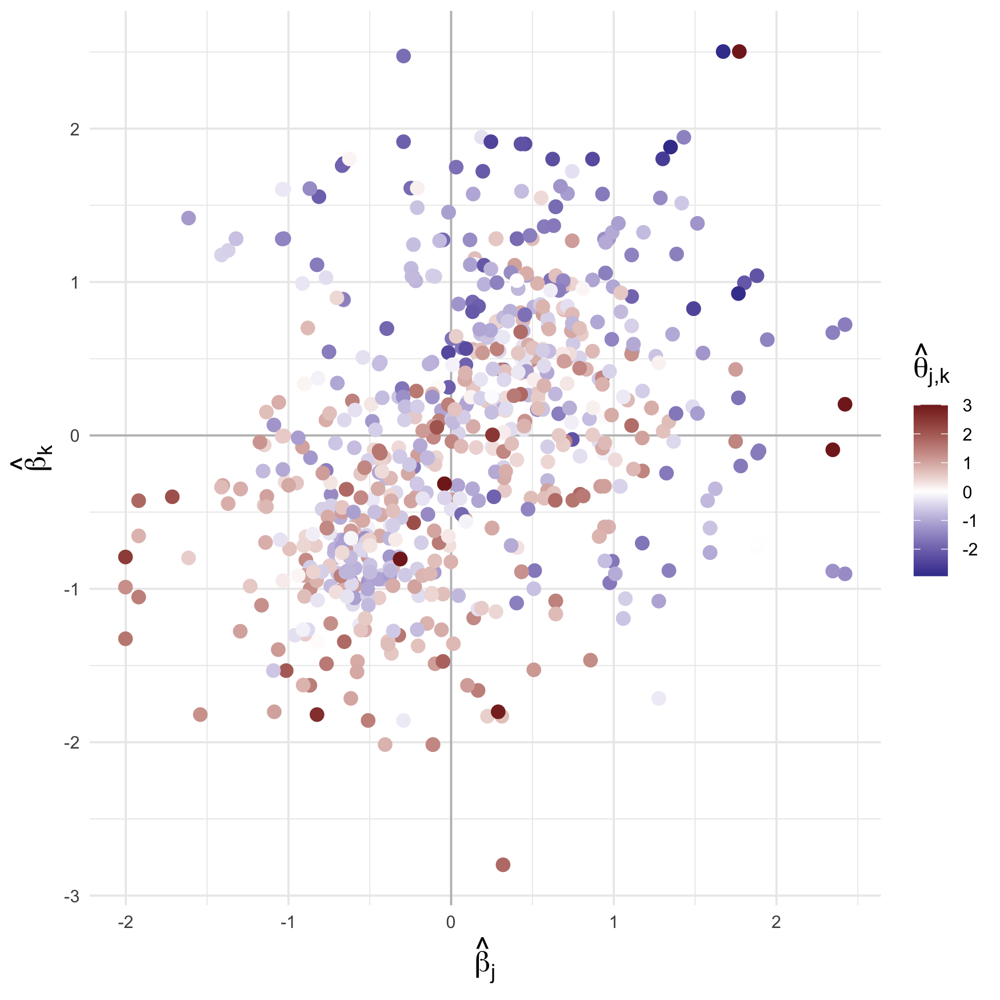
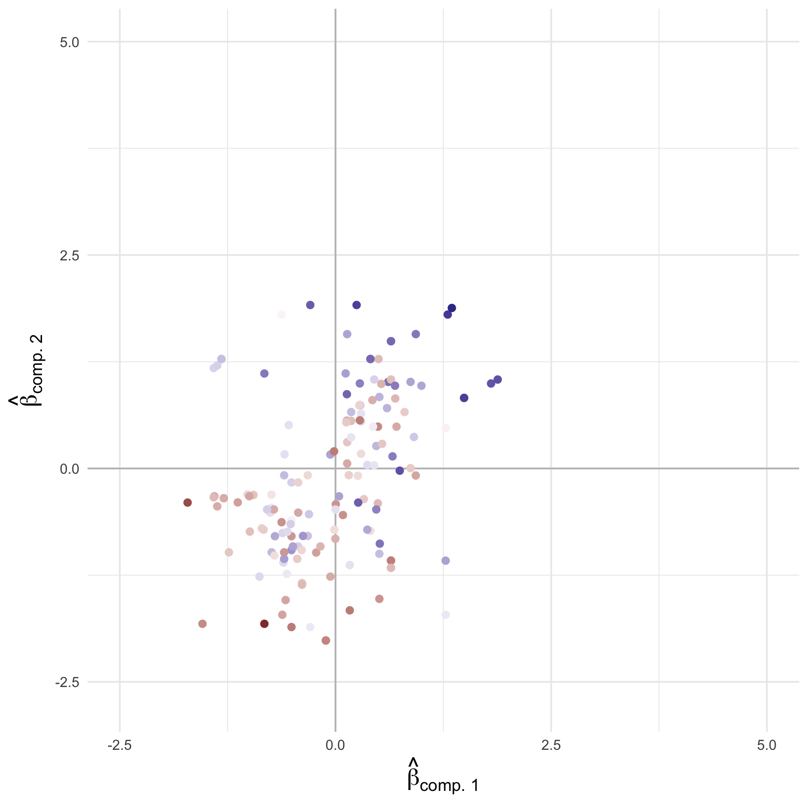
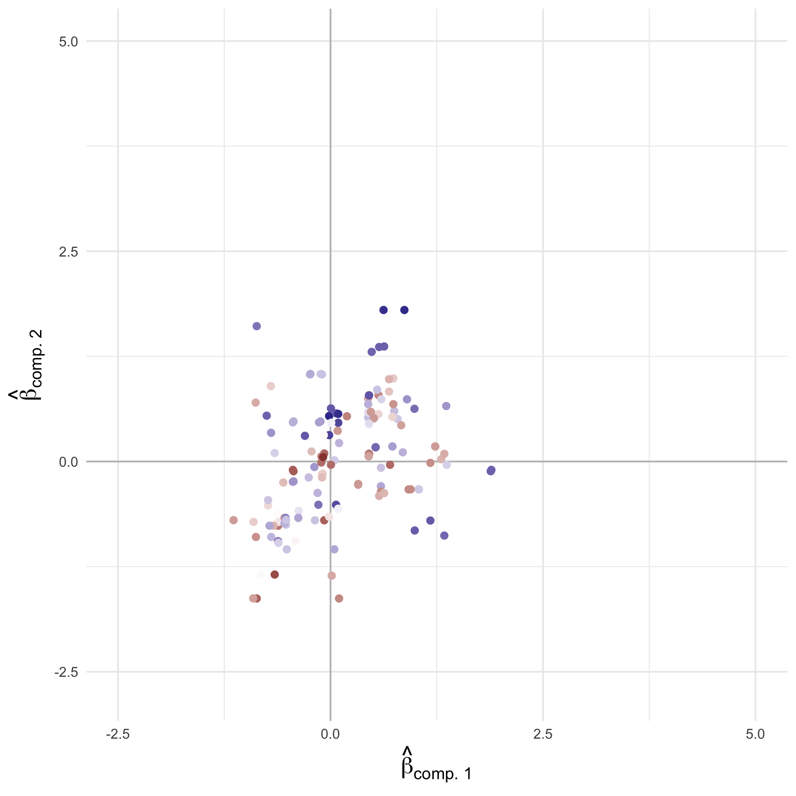
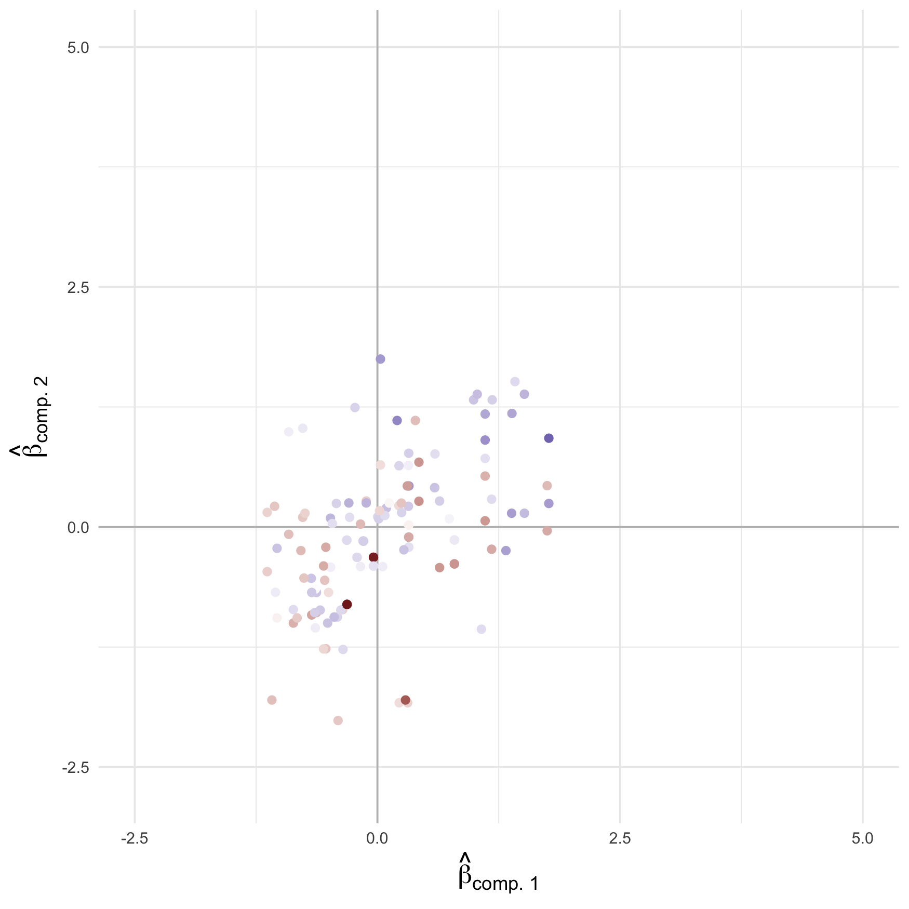
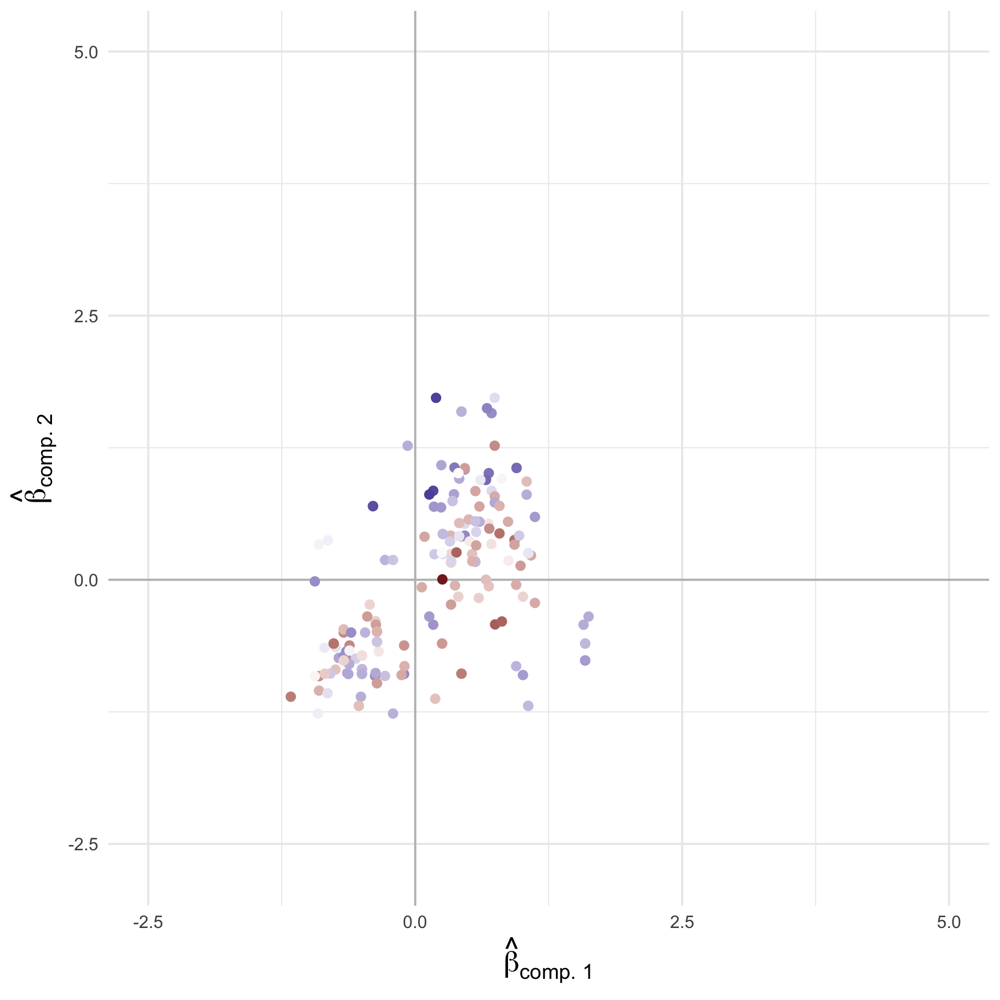
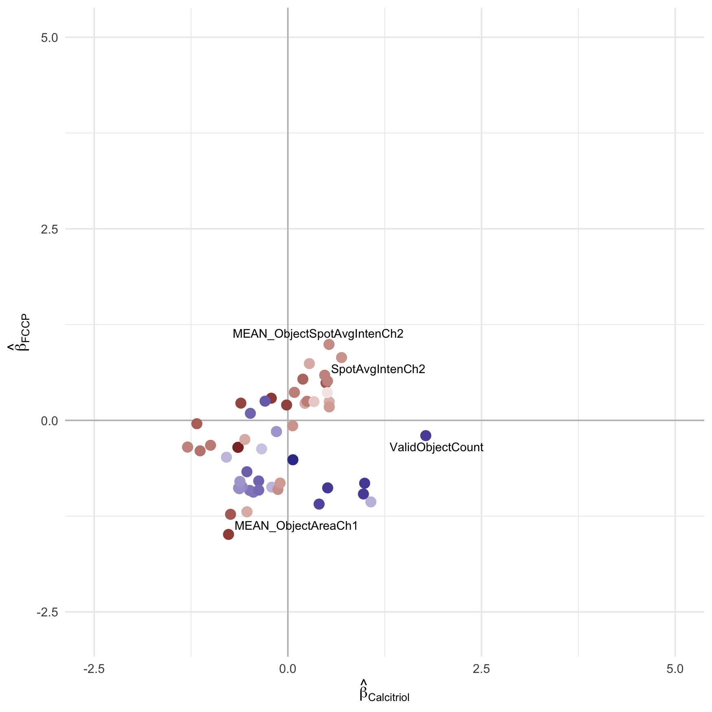

drug-interaction-analysis
================
Compiled at 2024-04-27 17:39:01 UTC

We use hiernet -a Lasso for (weak) hierarchical interactions- with CPSS
to robustly recover interaction effects between compounds on cell
morphology features. In addition we add a Huber loss to the optimization
problem to account for outlier in the data. We only focus on experiments
with a concentration of 10 uM per compound.

``` r
# Load necessary libraries
library(conflicted)
library(openxlsx)
library(ggplot2)
library(pheatmap)
library(RColorBrewer)
library(stabs)
library(reshape2)
library(tidyverse)
library(hrbrthemes)
library(viridis)
library(forcats)
library(readr)  # for read_csv
library(protoclust)  # for clustering methods
library(bnstruct)  # for data imputation (k-NN)
library(lsa)  # for cosine distance
library(factoextra)
library(gridExtra)
library(extrafont)  # for fonts
library(ggrastr)  # to rasterize plots
library(scales)
library(ggrepel)

# Install packages from GitHub
devtools::install_github("marastadler/hierNet")
library(hierNet)

# Plotting utilities
library(grid)
```

## Read data

``` r
data <- read.xlsx("data/Data_New_Protocol.xlsx")
```

``` r
Y <- data[, 23:ncol(data)]
rownames(Y) <- data$WellId
rownames(Y) <- gsub(" ", "", rownames(Y), fixed = TRUE)

Y[1:3, 1:3]
```

    ##       ValidObjectCount ObjectTotalAreaCh1 ObjectAvgAreaCh1
    ## 1-C05        2.2273848          2.6770824        -1.559677
    ## 1-C06        0.4862601          0.7403536        -1.294152
    ## 1-C07       -6.8546982         -8.5457492       -10.878427

## Input data X

``` r
dim(X)
```

    ## [1] 427  21

``` r
X[1:5, 1:5]
```

    ##       AMG900 Aloxistatin Berberine CA-074.Me Calcitriol
    ## 1-C05      0           1         0         0          0
    ## 1-C06      0           0         0         0          0
    ## 1-C07      0           0         0         0          0
    ## 1-C08      0           0         0         0          0
    ## 1-C09      0           0         1         0          0

``` r
colnames(X)[which(colnames(X) == "DMSO")] <- "1% DMSO"
```

### Plot Design matrix X

``` r
plt_h <- pheatmap(t(X), cluster_rows = F, cluster_cols = T, color = c("white", "darkgrey"),
         fontsize_col = 0.001)
```

<!-- -->

### Remove DMSO

``` r
# First, remove all rows (experiments) containing DMSO in X as well as in Y

# check if rows are ordered in the same way in X and Y
all(rownames(X) == rownames(Y))
```

    ## [1] TRUE

``` r
X_initital <- X
DMSO_experiments <- which(X[, "1% DMSO"] == 0)
X <- X[DMSO_experiments, ]

Y <- Y[DMSO_experiments,] 
# Then remove DMSO columns (since only zeros remain)
ind_DMSO <- which(colnames(X) == "1% DMSO")
X <- X[,-ind_DMSO]

dim(X)
```

    ## [1] 408  20

The experimental design consists of 408 samples and 20 compounds.

### Compute interactions

``` r
X <- as.matrix(X)
X_interactions <- cbind(X, hierNet::compute.interactions.c(X, diagonal = F)) 
dim(X_interactions)
```

    ## [1] 408 210

There are 210 interaction coefficients when considering all-pairs of
interactions from 20 compounds.

### How many replicates do exist?

``` r
X_unique <- X[!duplicated(X),]
dim(X_unique)
```

    ## [1] 50 20

There are 50 different experiments.

    ## index_replicate
    ##  1  2  3  4  5  6  7  8  9 10 11 12 13 14 15 16 17 18 19 20 21 22 23 24 25 26 
    ##  6  6  6  6  6  6  6  6  6  6  6  6  6  6  6  6 18 18 18 18  8  8  8  8  8  8 
    ## 27 28 29 30 31 32 33 34 35 36 37 38 39 40 41 42 43 44 45 46 47 48 49 50 
    ##  8  8  8  8  8  8  8  8  8  8  8  8  8  8  8  8  8  8  8  8  8  8  8  8

The individual experiments were repeated 6, 8 or 18 times.

``` r
dim(Y)
```

    ## [1] 408 146

For each experiment 146 features were observed.

## Scale Features Y

We scale the features to make our model coefficients comparable.

``` r
Ysc = scale(Y)
```

Let’s have a look at a subset of scaled Y

``` r
Ysc[1:5, 1:4]
```

    ##       ValidObjectCount ObjectTotalAreaCh1 ObjectAvgAreaCh1 ObjectTotalIntenCh1
    ## 1-C05        2.9873862          3.2535316       -0.5604606           2.8698264
    ## 1-C06        2.4516456          2.7697962       -0.5350305           2.3932335
    ## 1-C07        0.1928472          0.4504130       -1.4529479           0.7752702
    ## 1-C08        0.4534778          0.9303855       -0.4722284           1.0456893
    ## 1-C09        1.6263154          1.9015743       -0.7892487           1.7773177

We account for outlier samples by using a robust loss. We do not exclude
any experiments in advance.

# Robust HierNet for binary input data

In this version the design matrix X includes duplicated rows
representing replicates in the experiment.

# hierNet with Huber loss

``` r
fit.list.weak.10uM <- hiernet.stabsel.all(X = X, Y = Ysc,
                                            selection_probability = 0.6)
```

### Refitting

``` r
refit_10uM <- refit.all(X = X, Y = Ysc, fit_list_weak = 
                                   fit.list.weak.10uM)
refit_list_weak_10uM <- refit_10uM$refit_list
coef_list_weak_10uM <- refit_10uM$coef_list
```

### How good is the predictive accuracy?

<!-- -->

### How often do compounds occur together in the experimental design?

``` r
#Symmetrical matrix showing number of experiments including both compounds.
pheatmap(t(X) %*% X, cluster_rows = F, cluster_cols = F,
         border_color = "white", cellheight = 14, cellwidth = 14,
         fontsize_row = 11, fontsize_col = 11,
         na_col = "white",
         color = colorRampPalette((brewer.pal(n = 7, name =
  "Blues")))(100), 

  display_numbers = T, number_format =  "%.0f", number_color = "white",
  legend = F)
```

<!-- -->

### How often do we observe what?

``` r
plot.count.coef(coef_matrix_weak = coef_matrix_weak_10uM, X = X, cell_height = 17, cell_width = 17, fontsize_row = 12, fontsize_col = 12)
```

<!-- -->

We can only find combinatorial effects for compounds that got measured
together in an experiment. This means that our results are biased by the
experimental design. What might be of special interest are combinations
of compounds that occur often in the experiments, but which do not (or
almost not) show combinatorial effects in our model.

## All features into one plot

First we remove all SD, CV and SE features as they are difficult to
interpret.

``` r
names_vector <- rownames(coef_matrix_weak_10uM)

# Exclude names starting with "SD", "CV", or "SE"
filtered_names <- names_vector[!grepl("^(SD|CV|SE)", names_vector)]

coef_matrix_weak_10uM <- coef_matrix_weak_10uM[filtered_names, ]
dim(coef_matrix_weak_10uM)
```

    ## [1]  68 210

## Hierarchical clustering with prototypes

``` r
dat <- t(coef_matrix_weak_10uM)


## remove zero rows
keep_row <- which(rowSums(abs(dat)) != 0)
dat <- dat[keep_row,]
any(rowSums(abs(dat)) == 0)
```

    ## [1] FALSE

``` r
## remove zero columns
keep_col <- which(colSums(abs(dat)) != 0)
dat <- dat[, keep_col]
any(colSums(abs(dat)) == 0)
```

    ## [1] FALSE

``` r
dim(dat)
```

    ## [1] 80 68

``` r
## Compute cosine dissimilarity
cos_dist <- 1 - lsa::cosine(dat)

## Prototype clustering 
hc <- protoclust(cos_dist)
```

    ## converting to dist (note: ignores above diagonal)

``` r
n = ncol(dat)
k = 20
cut <- protocut(hc, k=k)

pr <- cut$protos[cut$cl]
dmat <- cos_dist
ifar <- which.max(dmat[cbind(1:n, pr[1:n])])

h <- hc$height[n - k]
```

``` r
## Plot

## delete protos to get the same structure as hclust
hc1 <- hc[-4]
class(hc1) <- "hclust"
den1 <- as.dendrogram(hc1)


## Plot dendrogram
p <- fviz_dend(den1, horiz = T, ylab = "", lwd = 0.1, main = "", 
               show_labels = F) +
  theme(axis.line = element_blank(),
        axis.text.x = element_blank(),
        axis.text.y = element_blank(),
        axis.ticks = element_blank(),
        axis.title.x = element_blank(),
        axis.title.y = element_blank(),
        legend.position = "none",
        panel.background = element_blank(),
        panel.border = element_blank(),
        panel.grid.major = element_blank(),
        panel.grid.minor = element_blank(),
        plot.background = element_blank())


clustersize <- table(cut$cl)

## combine clustersize and corresponding prototype
clustersize.protos <- data.frame("protos" = rownames(cos_dist)[cut$protos], 
                                 "clustersize" = clustersize)

## identify prototypes in list of all proteins
pr <- c()
j <- 0
for(i in cut$protos){
  j <- j + 1
  pr[j] <- which(hc$order == i)
}

## border coordinates for clusters
clustersize.protos$ordering <- pr
clustersize.protos <- clustersize.protos[order(clustersize.protos$ordering),]

cluster.borders <- cumsum(clustersize.protos$clustersize.Freq)
my.lines <- data.frame(x1 = 0.5, x2 = 80.5, y1 = cluster.borders[-20] + .5, 
                       y2 = cluster.borders[-20] + .5)


labels <- rownames(cos_dist)[cut$protos]

dat <- as.data.frame(t(dat))
dat.ordered <- dat[hc$order, ]
rownames(dat)[rownames(dat) %in% labels] <- paste0(rownames(dat)[rownames(dat) %in% labels], "*")
dat_long <- dat %>%
  as.data.frame() %>%
  rownames_to_column("feature") %>%
  pivot_longer(-c(feature), names_to = "drug", values_to = "Coefficient")


dat_long$feature<- factor(x = dat_long$feature,
                       levels = rownames(dat)[hc$order],
                       ordered = TRUE)
dat_long$drug <- factor(x = dat_long$drug,
                                 ## change ordering of modifications
                                 levels = unique(dat_long$drug),
                                 ordered = TRUE)
```

### Plot heatmap with borders and prototypes

<!-- -->

### Scaterplot representation

<!-- -->

We can’t label all features here, but we get a rough idea what kind of
effects are most prevalent. We see, for instance, many antagonistic
effects, where two compounds do have individual positive effects on a
feature, but in combination this effect is not that strong anymore
(upper right quadrant, blue points). We also see this behavior into the
other direction, where tow individual effects are negative, but the
additional combinatorial effect is positive (lower left quadrant, red
points). We also see multiple competitive (or even cancelling out)
effects between the compounds, where the two compounds show an opposite
behavior and the additional combinatorial effect promotes on of the two
behaviors.

## What does this figure look like if we stratify it?

## Channel 1: Nucleus

<!-- -->

The behavior in the Nucleus is very similar to the overall behavior.

## Channel 2: Endoplasmic reticulum

``` r
scatterplt_all(channel = "Ch2", C = coef_matrix_weak_10uM,
                           textsize = 0, max.overlaps = 0)
```

<!-- -->

## Channel 3: Nucleoli, cytoplasmic RNA

``` r
scatterplt_all(channel = "Ch3", C = coef_matrix_weak_10uM,
                           textsize = 0, max.overlaps = 0)
```

<!-- -->

## Channel 4: Golgi, plasma membrane, F-actin, cytoskeleton

``` r
scatterplt_all(channel = "Ch4", C = coef_matrix_weak_10uM,
                           textsize = 0, max.overlaps = 0)
```

<!-- -->

## Channel 5: Mitochondria

``` r
scatterplt_all(channel = "Ch5", C = coef_matrix_weak_10uM,
                           textsize = 0, max.overlaps = 0)
```

<!-- -->

# Specific compound combinations

Instead of looking into different channels, we can also look into this
representation by taking into account specific pairs of compounds.

There are different categories of behavior:

1.  Antagonists: In this category two compounds show similar individual
    effects, but in combination their effect is lowered (less strong
    then expected under independence of the two individual effects or
    even cancelled out).

In this summary I’m only focusing on combinations that affect many
features.

Here’s an example:

``` r
plot_interactions(x = "AMG900",  y = "Rotenone", 
                  coeff.matrix = t(coef_matrix_weak_10uM),
                  text.size = 3, max.overlaps = 10)
```

<!-- -->

``` r
plot_interactions(x = "Calcitriol",  y = "FCCP", 
                  coeff.matrix = t(coef_matrix_weak_10uM),
                  text.size = 3, max.overlaps = 5)
```

<!-- -->

## Files written

These files have been written to the target directory,
`data/drug-interaction-analysis`:

``` r
projthis::proj_dir_info(path_target())
```

    ## # A tibble: 0 × 4
    ## # ℹ 4 variables: path <fs::path>, type <fct>, size <fs::bytes>,
    ## #   modification_time <dttm>
